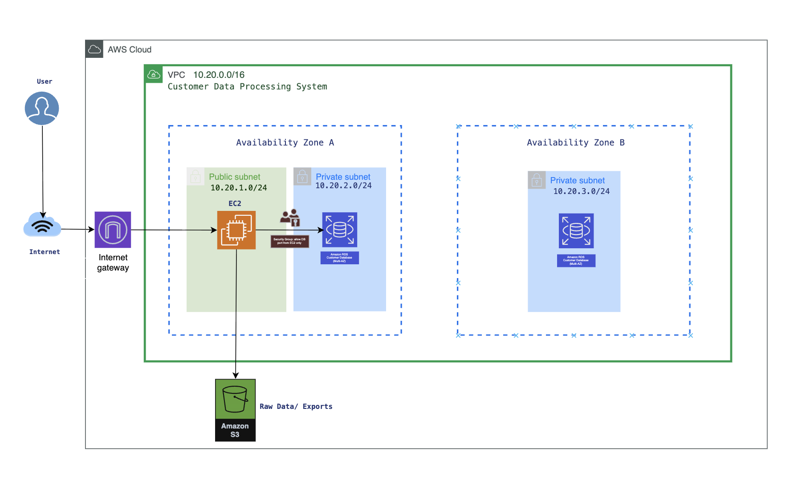

# Customer Data Processing System AWS
## Overview
This project demonstrates the design and deployment of a cloud-based customer data processing system using AWS.

## Architecture

## Architecture
- EC2 (processing layer)
- RDS (database layer)
- S3 (object storage)
- VPC with public/private subnets

## Features
- Secure communication between EC2 and RDS
- Data storage in S3
- SQL database validation
- CLI-based deployment

## Validation
- SSH connection to EC2
- Successful MySQL connection to RDS
- Data insertion and retrieval

## Report
See Phase1_Report.pdf for full documentation.
